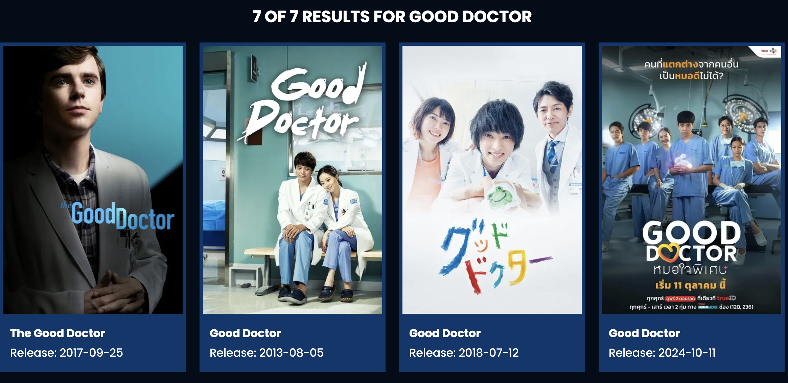

# 🎬 Movie App


Aplicação web para pesquisa e visualização de filmes, desenvolvida com **JavaScript puro (Vanilla JS)**, focada em simplicidade, performance e boas práticas de frontend.

---

## 🚀 Demo

👉 Aceder à aplicação:
https://your-username.github.io/movie-app/

---

## ✨ Funcionalidades

- 🔍 Pesquisa de filmes em tempo real
- 🎞️ Visualização de detalhes (título, descrição, rating, poster, etc.)
- ⭐ Integração com API externa (OMDb / TMDB)
- 📱 Interface responsiva (mobile-first)
- ⚡ Carregamento rápido sem frameworks

---

## 🛠️ Tecnologias Utilizadas

- **HTML5**
- **CSS3**
- **JavaScript (Vanilla JS)**
- **Fetch API**
- **API de Filmes (OMDb ou TMDB)**

---

## 🔑 Configuração da API Key

Para utilizar a aplicação, precisas de uma chave de API:

### 👉 OMDb API

1. Vai a: http://www.omdbapi.com/apikey.aspx
2. Cria uma conta gratuita
3. Recebe a tua API Key

### 👉 Configuração no projeto

Cria um ficheiro `config.js`:

```js
const API_KEY = 'SUA_API_KEY_AQUI';
```

Ou adiciona diretamente no teu script principal:

```js
const API_KEY = 'SUA_API_KEY_AQUI';
```

⚠️ **Nota:** Não partilhes a tua API Key em repositórios públicos.

---

## 📦 Instalação e Execução

```bash
# Clonar o repositório
git clone https://github.com/your-username/movie-app.git

# Entrar na pasta
cd movie-app
```

Depois abre o ficheiro:

```bash
index.html
```

no teu navegador.

---

## 📁 Estrutura do Projeto


movie-app/
│── index.html
│── lib/
  │── fontawosome.css
  │── swiper.css
│── script.js
│── images
└── css/
  │── style.css
  │── spinner.css

## 📁 OBS: 
eslint and prettier / for nice format
---

## 🚀 Deploy

### GitHub Pages

1. Vai a **Settings > Pages**
2. Seleciona a branch `main`
3. Guarda

A app ficará disponível em:
https://nanden-infinity.github.io/movie-app/

---

## 📸 Preview



---

## 🧠 Objetivos de Aprendizagem

Este projeto foi desenvolvido para praticar:

* Manipulação do DOM
* Consumo de APIs (fetch)
* Organização de código frontend
* Desenvolvimento sem frameworks

---

## 🤝 Contribuição

Contribuições são bem-vindas!

1. Fork do projeto
2. Criar uma branch (`feature/nova-displyResults-update`)
3. Commit das alterações
4. Push para a branch
5. Abrir Pull Request

---


## 👨‍💻 Autor
Feito por **nanden-infinity**


```
